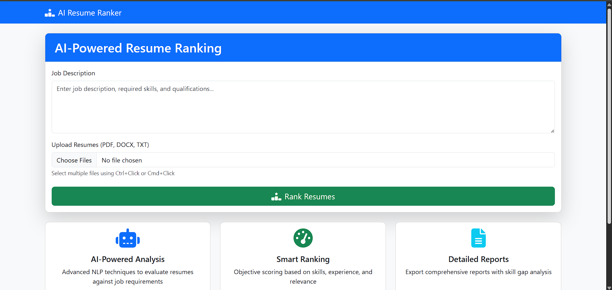

# 🧠 AI-Powered Resume Ranker




**Screenshot of the Resume Ranking Dashboard**

---

## 📌 Overview

The **AI-Powered Resume Ranker** is an intelligent application that automatically analyzes and ranks job applicants' resumes based on their relevance to a specific job description.

Leveraging advanced **Natural Language Processing (NLP)** techniques, this tool helps HR professionals and hiring managers streamline their recruitment process by:

- ✅ Automating initial resume screening  
- ✅ Identifying top candidates based on skill match  
- ✅ Highlighting skill gaps for each applicant  
- ✅ Providing detailed analysis reports  
- ✅ Reducing unconscious bias in hiring  

---

## 🌟 Key Features

### 🚀 Core Functionality

- Multi-format resume parsing (PDF, DOCX, TXT)
- NLP-powered text extraction and preprocessing
- TF-IDF vectorization and cosine similarity scoring
- Experience validation and scoring
- Skill gap analysis
- Interactive ranking dashboard

### 📊 Advanced Capabilities

- Bias reduction through objective scoring
- Candidate comparison view
- Detailed skill visualization
- Exportable reports (PDF/CSV)
- Responsive web interface
- Customizable scoring weights

---

## ⚙️ Technical Highlights

- **SpaCy** for NLP processing  
- **Scikit-learn** for machine learning  
- **Flask** for backend web framework  
- **PDFMiner** for parsing PDFs  
- **FPDF** for PDF report generation  
- **Bootstrap** for responsive UI  

---

## 🧱 Technology Stack

### 🔧 Backend

- Python (v3.9+)
- Flask (Web Framework)
- SpaCy (NLP)
- Scikit-learn (ML)
- PDFMiner (PDF Parsing)
- python-docx (DOCX Parsing)

### 🎨 Frontend

- HTML5 & CSS3
- Bootstrap 5
- JavaScript

---

## 🛠 Installation

### 📦 Prerequisites

- Python 3.9+
- `pip` package manager
- Virtual environment (recommended)

### 📥 Step-by-Step Setup

```bash
git clone https://github.com/yourusername/resume-ranker.git
cd resume-ranker

python -m venv venv

# For Linux/Mac:
source venv/bin/activate

# For Windows:
venv\Scripts\activate

pip install -r requirements.txt
python -m spacy download en_core_web_lg

python run.py
```
